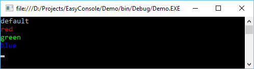
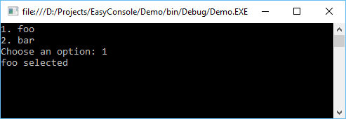

# EasyConsoleNG [](https://www.nuget.org/packages/EasyConsoleNG/)

EasyConsoleNG is a loose rework of [EasyConsole](https://github.com/splttingatms/EasyConsole) - a library to make it easier for developers to build a simple forms handling interface for a .NET console application. 

As of 2020 the original EasyConsole project is basically dead and not maintained any more. A fork was necessary to add new features and improve the library with modern-era .NET.

## Quick Start

### Inputs

```c#
// Create a new console
var console = new EasyConsole();

var value = Console.Input.ReadString("Enter a string");
Console.Output.WriteLine(ConsoleColor.Green, "You entered: '{0}'", value);
```

You can mark input's as required using `required: true` parameter. This would prevent from entering an empty value. 

```c#
var value2 = Console.Input.ReadString("Enter a required string", required: true);
Console.Output.WriteLine(ConsoleColor.Green, "You entered: '{0}'", value2);
```

Optionally a default value can be provided using `defaultValue: <value>` parameter:

```c#
var value3 = Console.Input.ReadString("Enter a required string with default", defaultValue: "foo");
Console.Output.WriteLine(ConsoleColor.Green, "You entered: '{0}'", value3);``
```

### Supported data types

Different data types are handled by corresponding `Read` methods:

| Data type       | Method                     | Output CLR Type               |
| --------------- | -------------------------- | ----------------------------- |
| string          | ReadString(...)            | `string`                      |
| boolean         | ReadBoolean(...)           | `bool`                        |
| boolean         | ReadNullableBoolean(...)   | `bool?`                       |
| int             | ReadLong(...)              | `long`                        |                
| int             | ReadNullableLong(...)      | `long?`                       | 
| long            | ReadInt(...)               | `int`                         |                
| long            | ReadNullableInt(...)       | `int?`                        | 
| float           | ReadFloat(...)             | `float`                       |
| float           | ReadNullableFloat(...)     | `float?`                      |
| double          | ReadDouble(...)            | `double`                      |
| double          | ReadNullableDouble(...)    | `double?`                     |
| Enum            | ReadEnum<T>(...)           | `<T>`                         |
| Enum            | ReadEnum(type, ...)        | `object`                      |
| DateTime        | ReadDateTime(...)          | `System.DateTime`             |
| DateTime        | ReadNullableDateTime(...)  | `System.DateTime?`            | 
| DateTimeOffset  | ReadDateTimeOffset(...)    | `System.DateTimeOffset`       |
| DateTimeOffset  | ReadNullableDateTimeOffset(...) | `System.DateTimeOffset?` |
| IP Address      | ReadIpAddress(...)          | `System.Net.IPAddress`        |
| IPv4 Address    | ReadIpV4Address(...)        | `System.Net.IPAddress`        |  
| IPv6 Address    | ReadIpV6Address(...)        | `System.Net.IPAddress`        |  
| URL             | ReadUrl(...)                | `System.Net.Uri`              | 
| Email Addres    | ReadEmail(...)              | `System.Net.Mail.MailAddress` |

### Custom data types

Custom data types can be parsed by providing custom parser function and optional custom validator. Parser is responsible for converting raw input string into usable format. Validator can be used to narrow down scope of allowed values.


```c#
var value = Console.Input.Read<Foo>(
	prompt: "Enter value as `<key>:<value>`", 
	required: false, 
	defaultValue: null, 
	parser: (rawValue) =>
	{
	    // Convert raw input to concrete type
	    var values = rawValue.Split(':');
	    if (values.Length == 2)
	    {
	        var output = new Foo
	        {
	            Key = values[0],
	            Value = values[1],
	        };
	
	        return ParseResult.AsSuccess(output);
	    }
	    return ParseResult.AsError<Foo>("Invalid value. Must be in `<key>:<value>` format");
	},
	validator: (foo) =>
	{
	    //Do additioanl validation here if needed
	    if (string.IsNullOrWhiteSpace(foo.Value))
	    {
	        return "Value must not be empty";
	    }
	
	    return null;
	});

Console.Output.WriteLine(ConsoleColor.Green, "You entered: '{0}'", value);
```

### Creating menus


The base functionality of the library is to provide an easy way to create console menus. A `Menu` consists of `Options` that will be presented to a user for selection. An option contains a name, that will be displayed to the user, and a callback function to invoke if the user selects the option. Render the menu in the console using the `Display()` method.

```c#
var menu = new EasyConsole.Menu()
      .Add("foo", () => Console.WriteLine("foo selected"))
      .Add("bar", () => Console.WriteLine("bar selected"));
menu.Display();
```


### Utilities - Input/Output
EasyConsole also provides input and output utilities to abstract the concept of dealing with the Console.

The `Output` class adds helper methods to control the color of text in the console.
```c#
Output.WriteLine("default");
Output.WriteLine(ConsoleColor.Red, "red");
Output.WriteLine(ConsoleColor.Green, "green");
Output.WriteLine(ConsoleColor.Blue, "blue");
```


The `Input` class adds helper methods that prompt the user for input. The utility takes care of displaying prompt text and handling parsing logic. For example, non-numeric input will be rejected by `ReadInt()` and the user will be re-prompted.
```c#
object input = Input.ReadString("Please enter a string:");
Output.WriteLine("You wrote: {0}", input);

input = Input.ReadInt("Please enter an integer (between 1 and 10):", min: 1, max: 10);
Output.WriteLine("You wrote: {0}", input);
```


### Program
All of these features can be put together to create complex programs with nested menus. A console program consists of a main `Program` class that contains `Pages`. The `Program` class is a navigator of pages and will keep a history of pages that a user is navigating through. Think of it as your browser history. To create a program you must subclass the `Program` class and add any `Pages` in the constructor. _Note_: Before exiting the constructor, you must set one of the pages as the _main_ page where the program should start.

```c#
class DemoProgram : Program
{
    public DemoProgram()
        : base("EasyConsole Demo", breadcrumbHeader: true)
    {
        AddPage(new MainPage(this));
        AddPage(new Page1(this));
        AddPage(new Page1A(this));
        AddPage(new Page1B(this));
        AddPage(new Page2(this));

        SetPage<MainPage>();
    }
}
```
A `Page` can display any type of data, but the subclass `MenuPage` was created to speed up the creation of pages that display menus. Simply pass in all of the options you want displayed into the `options` parameter in the constructor.

```c#
class MainPage : MenuPage
{
    public MainPage(Program program)
        : base("Main Page", program,
              new Option("Page 1", () => program.NavigateTo<Page1>()),
              new Option("Page 2", () => program.NavigateTo<Page2>()),
              new Option("Input", () => program.NavigateTo<InputPage>()))
    {
    }
}
```

As you can see, navigation is handled by the `Program` class. As you navigate through to different pages, the history is logged. You can then invoke `NavigateBack()` if you would like to go back to the previous page.

## Example Project
The source code contains an example console demo under the [Demo directory](https://github.com/splttingatms/EasyConsole/tree/master/Demo). It offers a demo with nested menu options as well as an example of how to prompt the user for input.

