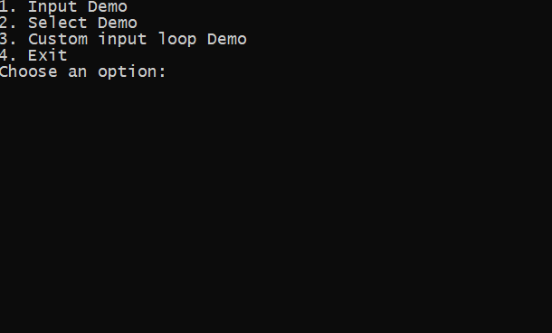

# EasyConsoleNG [](https://www.nuget.org/packages/EasyConsoleNG/)

EasyConsoleNG is a loose rework of [EasyConsole](https://github.com/splttingatms/EasyConsole) - a library to make it easier for developers to build a simple forms handling for a .NET console application. 

As of 2020 the original EasyConsole project is basically dead and not maintained any more. A fork was necessary to add new features and improve the library with modern-era .NET.

## Quick Start

### Inputs

```c#
// Create a new console
var console = new EasyConsole();

var value = Console.Input.ReadString("Enter a string");
Console.Output.WriteLine(ConsoleColor.Green, "You entered: '{0}'", value);
```


By default any input will be accepted, even empty one. You can mark input as required using `required: true` parameter. This would prevent from entering an empty value and will continue to prompt the user untill valid value is provided.

```c#
var value2 = Console.Input.ReadString("Enter a required string", required: true);
Console.Output.WriteLine(ConsoleColor.Green, "You entered: '{0}'", value2);
```


Optionally a default value can be provided using `defaultValue: <value>` parameter:

```c#
var value3 = Console.Input.ReadString("Enter a required string with default", defaultValue: "foo");
Console.Output.WriteLine(ConsoleColor.Green, "You entered: '{0}'", value3);``
```


### Supported data types

Different data types are handled by corresponding `Read` methods:

| Data type       | Method                     | Output CLR Type               |
| --------------- | -------------------------- | ----------------------------- |
| string          | ReadString(...)            | `string`                      |
| boolean         | ReadBoolean(...)           | `bool`                        |
| boolean         | ReadNullableBoolean(...)   | `bool?`                       |
| int             | ReadLong(...)              | `long`                        |                
| int             | ReadNullableLong(...)      | `long?`                       | 
| long            | ReadInt(...)               | `int`                         |                
| long            | ReadNullableInt(...)       | `int?`                        | 
| float           | ReadFloat(...)             | `float`                       |
| float           | ReadNullableFloat(...)     | `float?`                      |
| double          | ReadDouble(...)            | `double`                      |
| double          | ReadNullableDouble(...)    | `double?`                     |
| Enum            | ReadEnum<T>(...)           | `<T>`                         |
| Enum            | ReadEnum(type, ...)        | `object`                      |
| DateTime        | ReadDateTime(...)          | `System.DateTime`             |
| DateTime        | ReadNullableDateTime(...)  | `System.DateTime?`            | 
| DateTimeOffset  | ReadDateTimeOffset(...)    | `System.DateTimeOffset`       |
| DateTimeOffset  | ReadNullableDateTimeOffset(...) | `System.DateTimeOffset?` |
| IP Address      | ReadIpAddress(...)          | `System.Net.IPAddress`        |
| IPv4 Address    | ReadIpV4Address(...)        | `System.Net.IPAddress`        |  
| IPv6 Address    | ReadIpV6Address(...)        | `System.Net.IPAddress`        |  
| URL             | ReadUrl(...)                | `System.Net.Uri`              | 
| Email Addres    | ReadEmail(...)              | `System.Net.Mail.MailAddress` |

### Custom data types

Custom data types can be parsed by providing custom parser function and optional custom validator. Parser is responsible for converting raw input string into usable format. Validator can be used to narrow down scope of allowed values.

```c#
var value = Console.Input.Read<Foo>(
    prompt: "Enter value as `<key>:<value>`", 
    required: false, 
    defaultValue: null, 
    parser: (rawValue) =>
    {
        // Convert raw input to concrete type
        var values = rawValue.Split(':');
        if (values.Length == 2)
        {
            var output = new Foo
            {
                Key = values[0],
                Value = values[1],
            };
    
            return ParseResult.AsSuccess(output);
        }
        return ParseResult.AsError<Foo>("Invalid value. Must be in `<key>:<value>` format");
    },
    validator: (foo) =>
    {
        //Do additioanl validation here if needed
        if (string.IsNullOrWhiteSpace(foo.Value))
        {
            return "Value must not be empty";
        }
    
        return null;
    });

Console.Output.WriteLine(ConsoleColor.Green, "You entered: '{0}'", value);
```

### Creating menus

This library provide an easy way to create console menus. 



A `Menu` consists of `Pages` that will be presented to a user for selection. Each page displays it's content using a `Display()` method. See the Demo project in the repository for complete example.

Simple page looks like that:

```c#

    public class DemoPage : Page
    {
        public DemoPage(Menu menu) : base(menu)
        {
        }

        public override void Display()
        {
            // do something here
            Console.WriteLine("Demo page");
            Console.Input.ReadString("Press [Enter] to navigate back");
            Menu.Pop();
        }
    }
```

Pages needs to be added to the menu and associated with a name to display them.

```c#
// Create a new menu
var menu = new Menu();

// Add named pages to the menu
menu.AddPage<DemoPage>("demo-page");

// Show the menu
menu.Display();
```

### Nested menus

Nested menus can be created by creating a Page inheriting from `SelectPage`:

```c#
   public class MainMenuPage : SelectPage
    {
        public MainMenuPage(Menu menu) : base(menu)
        {
            AddOption("Foo", () =>
            {
                Console.WriteLine("You selected FOO");
                Console.Input.ReadString("Press [Enter] to navigate back");
                Menu.Pop();
            });
            AddOption("Bar", () =>
            {
                Console.WriteLine("You selected BAR");
                Console.Input.ReadString("Press [Enter] to navigate back");
                Menu.Pop();
            });
        }
    }
```

```c#
// Create a new menu
var menu = new Menu();

// Add named pages to the menu
menu.AddPage<MainMenuPage>("menu-page");

// Show the menu
menu.Display();
```

### Navigating through pages

The menu works as a stack. You can `Push()` a page to replace current page with a new page and `Pop()` to go back. 

```c#
//Change page using it's name. A page with that name needs to be added to the menu first.
menu.Push("name-of-page")

// Change the page using new page's type
menu.Push<DemoPage>()

// Change the page using new page's instance
menu.Push(new DemoPage(menu))
```

Addionally you can `Replace()` a page. This removes current page from the stack and pushes the new page.

```c#
menu.Replace("name-of-page")
menu.Replace<DemoPage>()
menu.Replace(new DemoPage(menu))
```

## Example Project
The source code contains an example application `EasyConsoleNG.Demo` project. It offers a demo with nested menu options as well as an example of how to prompt the user for input.

